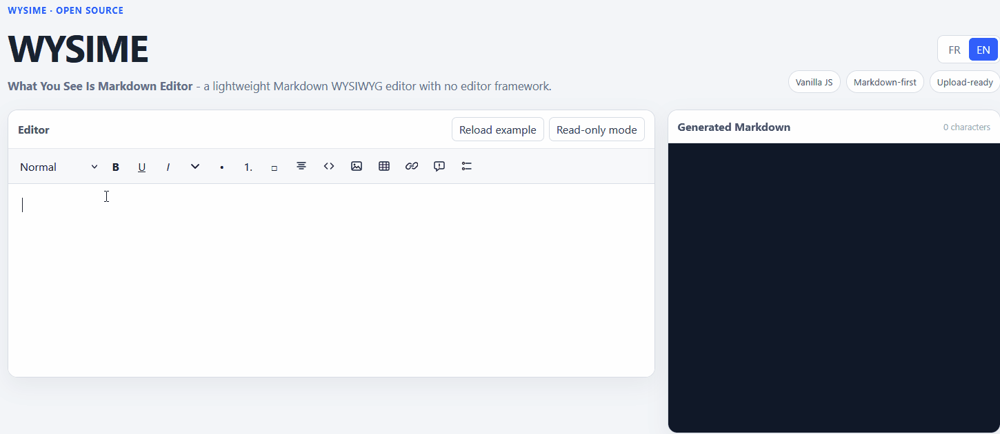

# WYSIME

> **What You See Is Markdown Editor**
> A lightweight, framework-free Markdown WYSIWYG editor written in Vanilla JavaScript.

[](https://www.npmjs.com/package/wysime)
[](https://www.npmjs.com/package/wysime)
[](LICENSE)

**[Live Demo](https://wysime.com/#demo)** ·
**[npm](https://www.npmjs.com/package/wysime)** ·
**[Documentation](./docs/INTEGRATION.md)** ·
**[Report a bug](https://github.com/ColinMasciinIT/WYSIME/issues)**

<p align="center">
  
</p>

WYSIME is a Markdown-first editor designed and created by **Colin Timaxian**. It provides a rich WYSIWYG editing surface while keeping Markdown as the canonical stored format.

The standalone library is deliberately host-agnostic: it contains no application-specific route, authentication mechanism, storage backend or business module.

## Status

`0.1.1` is a patch release of WYSIME that adds a toolbar action for inspecting the generated Markdown in a dedicated modal.

The editor is usable, but the API and Markdown serialization rules may still evolve during the `0.x` series.

## Highlights

- Vanilla JavaScript; no ProseMirror, Tiptap, Quill, CodeMirror, Milkdown or Toast UI runtime.
- `contenteditable` editing surface using Selection, Range and DocumentFragment APIs.
- Markdown -> sanitized HTML renderer.
- WYSIWYG HTML -> Markdown serializer.
- Headings, bold, italic, underline, strike, subscript, superscript and inline code.
- Bulleted lists, ordered lists and task items.
- Text alignment.
- Links, tables and fenced code blocks.
- Contextual table editing: add/remove rows and columns, delete the table, and toggle first-row/first-column headers.
- Configurable image upload, drag-and-drop and image width metadata.
- Editorial callouts: `:::info`, `:::attention`, `:::succes`, `:::critique`, `:::danger`.
- Procedure blocks: `:::steps`.
- Front matter stripping for rendering.
- DOMPurify sanitization plus URL/style restrictions.
- Read-only mode.
- Responsive toolbar.
- Dedicated toolbar button to inspect the generated Markdown in a modal.
- French and English interface through `locale: "fr" | "en"`.
- Bilingual French/English demo.
- No hard-coded backend.
- No `document.execCommand()` dependency.

## Installation

The npm package name is currently `wysime` : https://www.npmjs.com/package/wysime

```bash
npm install wysime
```

For local review:

```bash
npm install
npm run dev
```

## Basic usage

```html
<textarea id="content"></textarea>
```

```javascript
import { WYSIMEditor } from "wysime";
import "wysime/style.css";

const editor = new WYSIMEditor("#content", {
  locale: "en",
  onChange(markdown) {
    console.log(markdown);
  }
});
```

When the target is a `<textarea>`, its value remains synchronized with the canonical Markdown and can still be submitted by a normal HTML form.

## Image upload

WYSIME does not decide where files are stored. The host application provides an upload adapter:

```javascript
const editor = new WYSIMEditor("#content", {
  images: true,
  uploadImage: async (file) => {
    const body = new FormData();
    body.append("file", file);

    const response = await fetch("/api/uploads", {
      method: "POST",
      body
    });

    if (!response.ok) throw new Error("Upload failed");

    const result = await response.json();

    return {
      url: result.url,
      alt: result.originalName || file.name,
      width: "60%"
    };
  }
});
```

The callback may return a URL string or an object:

```javascript
{
  url: "/uploads/image.png",
  alt: "Architecture",
  width: "60%"
}
```

The default client-side limit is 8 MiB. PNG, JPEG, GIF and WebP are accepted by default. Browser-side checks are convenience checks only; repeat validation on the server.

## Internal links

Host applications may explicitly expose internal destinations:

```javascript
new WYSIMEditor("#content", {
  internalLinks: [
    { label: "Dashboard", href: "/dashboard" },
    { label: "Support", href: "/support" },
    { label: "Section", href: "#section" }
  ]
});
```

## Main API

### `new WYSIMEditor(target, options)`

`target` may be a CSS selector, a `<textarea>`, or another mount element.

| Option | Type | Default | Purpose |
| --- | --- | --- | --- |
| `locale` | `"fr" \| "en"` | `"fr"` | Built-in editor/dialog language |
| `images` | boolean | `true` | Enable image insertion |
| `uploadImage` | function | `null` | Host upload adapter |
| `maxImageBytes` | number | `8 * 1024 * 1024` | Client-side image size limit |
| `acceptedImageTypes` | string[] | PNG/JPEG/GIF/WebP | Allowed client MIME types |
| `initialValue` | string | `""` | Initial Markdown for non-textarea mounts |
| `placeholder` | string | locale-dependent | Empty editor hint |
| `readOnly` | boolean | `false` | Disable editing and hide toolbar |
| `autofocus` | boolean | `false` | Focus editor after mounting |
| `internalLinks` | array | `[]` | Host-defined internal links |
| `sanitizeOptions` | object | `{}` | Sanitizer policy overrides |
| `onChange` | function | `null` | Called after Markdown changes |
| `linkDialog` | function | built-in | Replace the default link dialog |
| `tableDialog` | function | built-in | Replace the table dialog |
| `codeDialog` | function | built-in | Replace the code dialog |
| `calloutDialog` | function | built-in | Replace the callout dialog |
| `stepsDialog` | function | built-in | Replace the steps dialog |

### Instance methods

```javascript
editor.getMarkdown();
editor.setMarkdown("# Document");
editor.getHtml();
editor.insertMarkdown("**text**");
editor.insertHtml("<strong>text</strong>");
editor.setReadOnly(true);
editor.focus();
editor.destroy();
```

## Events

In addition to `onChange`, the editor host dispatches:

```text
wysime:change
```

with:

```javascript
{
  markdown,
  editor
}
```

## Editorial Markdown extensions

See [`docs/EDITORIAL_MARKDOWN.md`](./docs/EDITORIAL_MARKDOWN.md).

Callout:

```markdown
:::info Optional title
Content
:::
```

Procedure:

```markdown
:::steps
1. First step
2. Second step
:::
```

Image width:

```markdown
{width=70%}
```

Controlled alignment:

```html
<p style="text-align:center">Centered text</p>
```

## Security model

WYSIME treats generated and pasted HTML as untrusted content:

1. Markdown is converted to HTML by the local renderer.
2. HTML is sanitized with DOMPurify.
3. A second policy restricts link/image URL schemes and inline styles.
4. Rich HTML pasted into the editing surface is sanitized before insertion.
5. Uploads remain the responsibility of the host application and must be validated server-side.

See [`SECURITY.md`](./SECURITY.md).

## Build

```bash
npm run build
```

Expected output:

```text
dist/
├── wysime.js
├── wysime.umd.cjs
└── wysime.css
```

DOMPurify remains an explicit runtime dependency and is externalized from the library bundle.

## Tests

```bash
npm test
```

The suite covers Markdown rendering, sanitization, Markdown/HTML round trips, selection-aware actions, contextual table editing, architecture constraints and the main editor lifecycle.

## Project structure

```text
WYSIME/
├── src/
│   ├── editor.js
│   ├── dom.js
│   ├── markdown.js
│   ├── html-to-markdown.js
│   ├── sanitize.js
│   ├── dialogs.js
│   ├── i18n.js
│   ├── icons.js
│   ├── styles.css
│   └── index.js
├── demo/
├── docs/
│   ├── EDITORIAL_MARKDOWN.md
│   ├── INTEGRATION.md
│   └── ORIGIN_AND_ARCHITECTURE.md
├── tests/
├── types/
├── AUTHORS.md
├── SECURITY.md
├── CONTRIBUTING.md
├── THIRD_PARTY_NOTICES.md
└── LICENSE
```

## Architectural choices

### Markdown is the source of truth

The WYSIWYG DOM is an editing representation. Persisted content remains portable, diffable Markdown rather than a proprietary document schema.

### No editor framework

The goal is to keep the editing layer inspectable and lightweight while retaining explicit control over Markdown serialization.

### DOMPurify is intentional

HTML sanitization is security-sensitive. Instead of reimplementing an HTML sanitizer, WYSIME isolates that responsibility in DOMPurify. See [`THIRD_PARTY_NOTICES.md`](./THIRD_PARTY_NOTICES.md).

## Known limitations in 0.1.1

- The parser targets the documented editorial subset, not every CommonMark/GFM edge case.
- Complex nested inline formatting may normalize during a WYSIWYG round trip.
- Markdown tables only provide basic escaped-pipe handling.
- Complex HTML tables may be preserved as controlled HTML.
- Collaborative editing, comments, track changes and real-time cursors are out of scope.
- Syntax highlighting is not bundled; code blocks expose `language-*` classes for an external highlighter.

## Author

**WYSIME was designed and created by Colin Timaxian.**

See [`AUTHORS.md`](./AUTHORS.md).

## License

MIT License - Copyright (c) 2026 Colin Timaxian.

Third-party licenses are documented in [`THIRD_PARTY_NOTICES.md`](./THIRD_PARTY_NOTICES.md).
