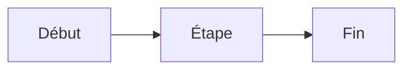

# Editorial Markdown reference

This document describes the Markdown subset intentionally supported by WYSIME 0.1.x.

## Headings

```markdown
# Heading 1
## Heading 2
### Heading 3
#### Heading 4
```

Levels 5 and 6 are intentionally outside the editorial subset.

## Inline formatting

```markdown
**bold**
*italic*
~~strikethrough~~
`inline code`
<u>underline</u>
H<sub>2</sub>O
m<sup>2</sup>
```

## Lists

```markdown
- Item
- Item

1. First
2. Second
```

Task items:

```markdown
- [ ] Pending
- [x] Done
```

## Blockquotes

```markdown
> Quoted content
```

## Links

```markdown
[OpenAI](https://openai.com)
[Internal](/documentation)
[Anchor](#section)
[Email](mailto:contact@example.com)
[With tooltip](https://example.com "Tooltip")
```

Allowed link schemes are intentionally restricted.

## Images

```markdown

```

Optional width extension:

```markdown
{width=70%}
{width=640px}
```

The editor UI defaults inserted images to `60%` width. Double-click an image to edit its alt text and width.

## Tables

```markdown
| Name | Status |
| --- | --- |
| API | Ready |
| UI | Ready |
```

Tables using row headers or structures that cannot be represented faithfully as simple Markdown may be serialized as controlled HTML tables.

## Code blocks

````markdown
```javascript
console.log("Hello");
```
````

The language becomes a `language-*` CSS class. Syntax highlighting is deliberately left to the host application.

## Editorial callouts

Information:

```markdown
:::info
Context for the reader.
:::
```

Custom title:

```markdown
:::attention Before you start
Check the prerequisites.
:::
```

Supported names:

- `info`
- `attention`
- `succes` or `success`
- `critique` or `critical`
- `danger`

Nested `:::` blocks are intentionally not supported in 0.1.x.

## Procedures

```markdown
:::steps
1. Open the module
2. Select the item
3. Save
:::
```

Each step may contain multiple lines.

## Controlled alignment

```html
<p style="text-align:center">Centered</p>
<h2 style="text-align:right">Right aligned</h2>
```

Supported values:

- `left`
- `center`
- `right`
- `justify`

Arbitrary CSS is removed by the sanitizer.

## Front matter

A YAML-like front matter block at the very start is removed from visual rendering:

```markdown
---
title: Example
author: Colin Timaxian
---

# Visible content
```

The editor does not interpret these metadata fields.

## Deliberately unsupported

The following are not guaranteed in 0.1.x:

- Markdown footnotes;
- reference-style links;
- definition lists;
- Mermaid rendering;
- LaTeX / MathJax;
- arbitrary HTML;
- arbitrary inline CSS;
- automatic heading anchors;
- full CommonMark/GFM edge-case compatibility.

## Equations (v0.2.0)

Inline equations use dollar delimiters:

```markdown
La relation est $E = mc^2$.
```

Block equations use double-dollar delimiters on dedicated lines:

```markdown
$$
x = \frac{-b \pm \sqrt{b^2 - 4ac}}{2a}
$$
```

The stored source is LaTeX. WYSIME uses MathLive for visual input and KaTeX for display when `equations` is enabled.

## Data charts (v0.2.0)

WYSIME data charts use a fenced `chart` block. The first line defines the chart type and an optional quoted title. Options such as `unit`, `x`, `y` and `legend` may follow.

````markdown
```chart
bar "Chiffre d'affaires"
unit: €
Janvier: 12000
Février: 15500
Mars: 18200
```
````

Supported types: `bar`, `line`, `area`, `pie`, `scatter`.

Scatter data uses one numeric `x,y` pair per line:

````markdown
```chart
scatter "Mesures"
x: Temps
y: Valeur
1,2
2,4
3,5
```
````

The `chart` DSL is intentionally independent from the Vega-Lite JSON schema. WYSIME converts it to Vega-Lite at render time so stored Markdown remains compact and readable.

## Mermaid diagrams (v0.2.0)

Standard Mermaid source is kept unchanged inside a fenced block:

````markdown

````

WYSIME renders the block using Mermaid with strict security mode.
